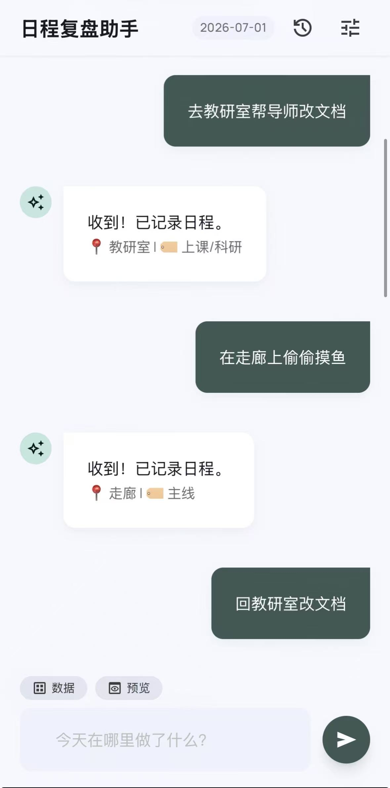
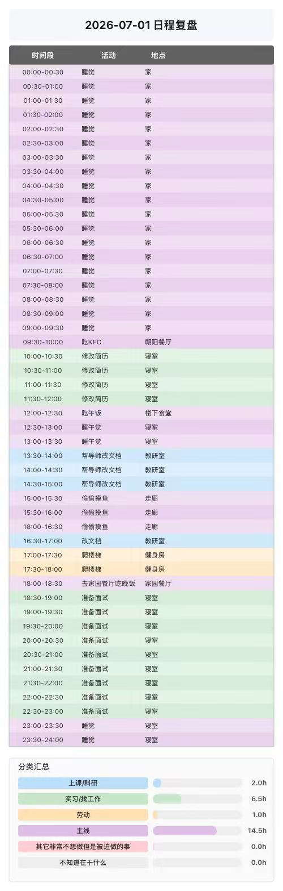
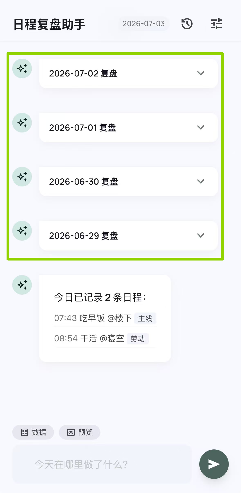
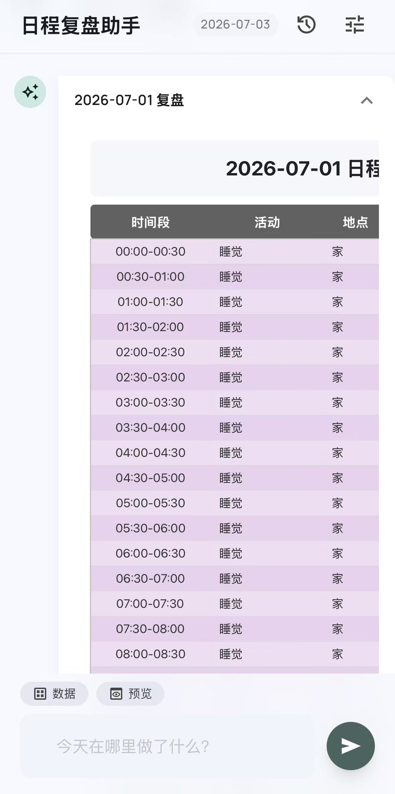
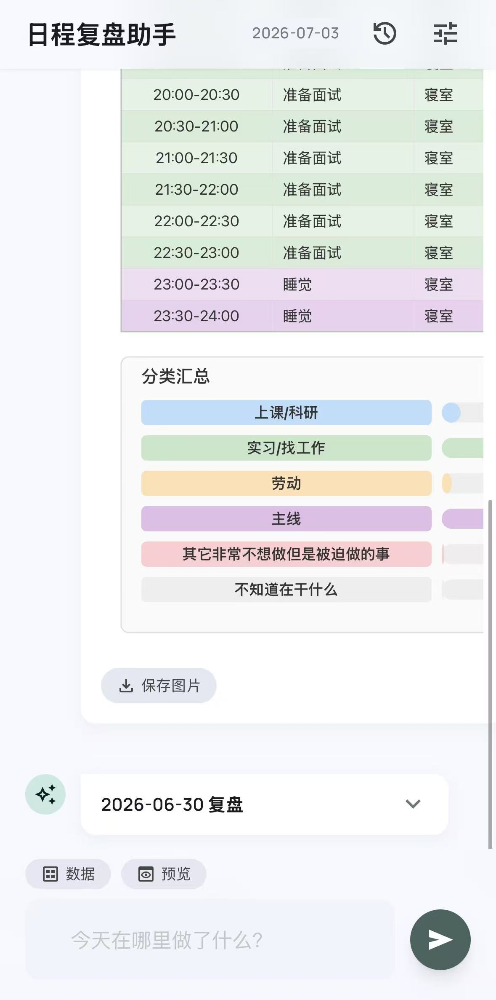
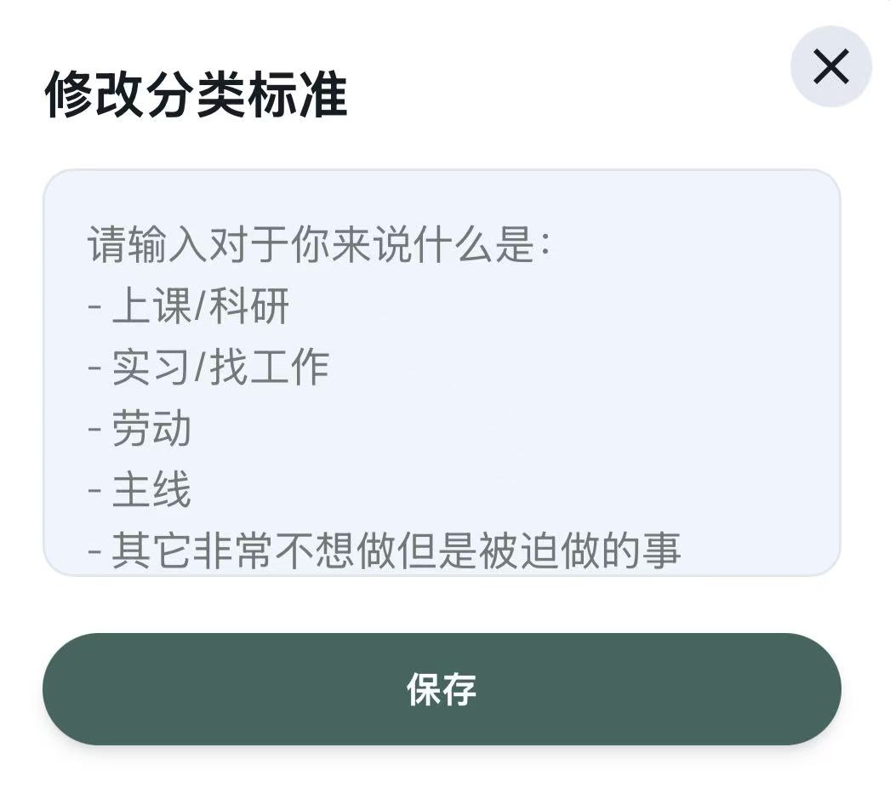
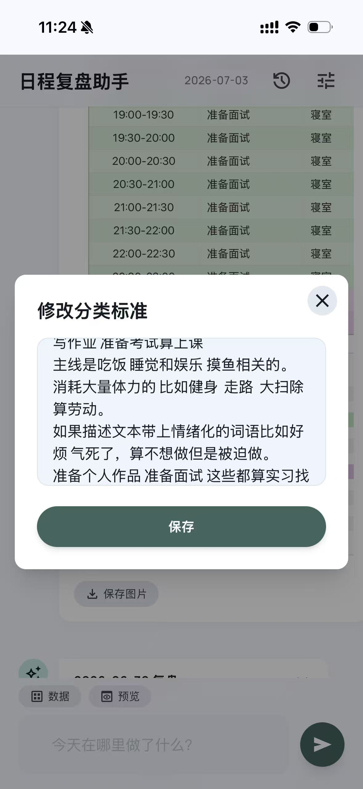
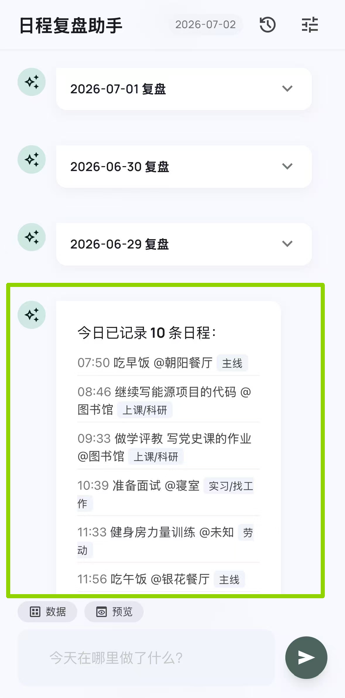
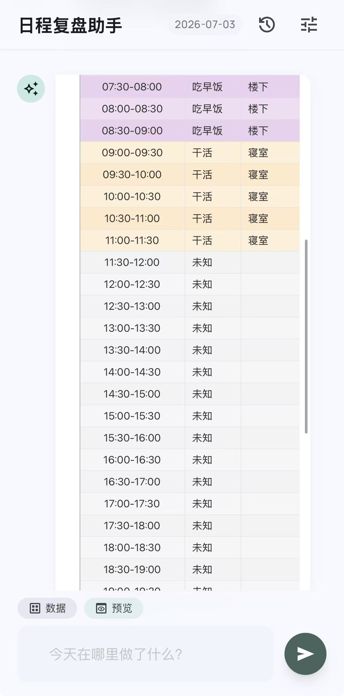

### 背景与需求
研究生每天N线并行belike:
要上课修学分，写作业  
一边完成课题组的项目，一边还想着毕业论文怎么办  
为找工作的事情发愁

经常忙活了一天感觉什么也没做  
睡觉的时候心理空落落的  

需要一个工具方便地记录每天什么时段做什么，强化做事情的心理暗示  
方便每日复盘  
为时间管理做调整  
### 核心功能
用户像聊天一样输入自然语言（例如"去图书馆写论文"），
作为某个日程开始的标志
AI自动从中提取地点、事件、分类，记录为一条带时间戳的日程条目。

每条日程会被 AI 归入 6 个预设类别（上课/科研、实习/找工作、劳动、主线、被迫做的事、不知道在干什么）（目前的类别设置直接参照了小红书博主Dusbin）

用户完成一天的记录后，会被整理成一张 48 格（每格 30 分钟）的时间分配表——可以直观看到一天 24 小时都在干什么、在哪里。
  
图表底部自动生成分类汇总条形图，显示每类耗时多少小时，一眼看清时间在不同类别事项上的比重。

某天打开APP界面，系统自动将过去7日的时间分配表以可折叠气泡的形式展示。如果7日内有某日没有消息记录，则不展示。  
  

点击气泡右边的折叠键，可以看到完整表格，滑到最下方可以保存图片  

        
点击左上角的调整按钮，可以自定义分类标准，告诉AI对于事件如何做归类  

### 快捷功能
点击输入框上方的数据按钮，可以快速回顾今天已经发的全部消息记录  
  
点击输入框上方的预览按钮，可以看到当天 截止目前为止的时间分配情况。还没有发生的时间会统一显示未知。  
  

## 即将增加的功能

用户可以自行补充忘记发消息记录的日程

自定义各种事件分类

数据库支持记录更长周期的日程，并在上方历史button中通过日期选择回看特定某天的日程
